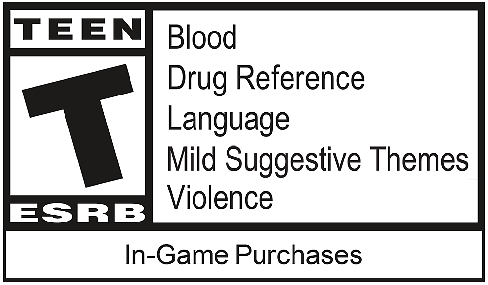
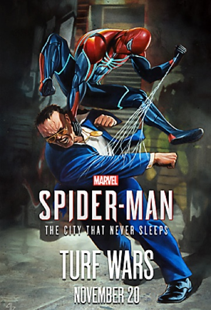
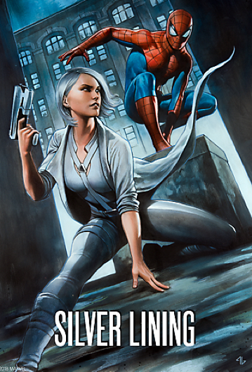

# Marvel's Spider-man Game Website
As a big fan of the Marvel's Spider-man Game, I re-designed and developed the original website more dynamic and creative like the comics using HTML5 and CSS3 in 3 weeks in 2018. Note that this is for a school project only and all images (including logo) and content are from the game. Click this [link](http://marvelspiderman.surge.sh/) to see the final look of the website! 

------------

## Table of Content
- [Motivation](https://github.com/jjessicacho/spiderman#motivation)
- [Technologies](https://github.com/jjessicacho/spiderman#technologies)
- [Setup](https://github.com/jjessicacho/spiderman#setup)
- [Highlighted-features](https://github.com/jjessicacho/spiderman#highlighted-features)
- [Sources](https://github.com/jjessicacho/spiderman#soruces)

------------

## Motivation
The original Marvel's Spider-man Game website developed by Insomniac had many good information. However, their design of the website was not appealing as much. To solve this problem, I decided to create an event page like the comics mainly introducing the game and the characters. 

------------

## Technologies 
Languages and tools I used for this project:
- HTML 5
- CSS 3
- JavaScript (ES6)
- Surge 

------------

## Setup 

### Web Hosting 
Although I hosted this website using both Github pages and Surge, I recommend you to use the [surge](http://marvelspiderman.surge.sh/) link. *Github pages for this project is not working at the moment.*

### Browser Support 
- Works the best: Chrome 29 ~ current version 
- Recommended: Firefox 16 ~ current version 
- Not Recommend: IE

### Screen Size Requirement 
None. This project is fully responsive to mobile(max: 768px), tablet (min: 768px) and desktop (min: 1440px). 

------------

## Highlighted-features 

### Navigation


Since this project has two pages only, I created a simple navigation with a call-to-action using Flexbox. 
```html
 <div class="nav-wrapper">
            <a href="index.html"></a>
            <nav>
                <ul>
                    <li>
                        <a href="villains.html">Villains</a>
                    </li>
                    <li class="btn">
                        <a href="https://store.playstation.com/en-us/product/UP9000-CUSA02299_00-SMDIGITALDELUXE0?smcid=pdc%3Aus-en%3Aweb-pdc-games-marvels-spider-man-ps4%3Apar-Buy%20Now%3Anull%3A">Buy Now</a>
                    </li>
                </ul>
            </nav>
       </div>
```
```css
.nav-wrapper {
    ...
    display: flex;
    justify-content: space-between;
    align-items: center;
}
```

The first time when I created this website back in 2018, I only learned HTML and CSS. Therefore, I just simply replaced the categories underneath the logo on mobile screen.

Updates in 2020, the categories are now hidden on mobile screen. *However, it still needs to developed for a hamburger menu with JavaScript.*

### Cartoon 


In this section, I placed elements using Flexbox and position properties. 
```html
<section class="cartoon-cell-block">
            <div class="cell first">
              <div class="text-bubble">
                <h1>Marvel's Spider-Man. Be greater.</h1>
                <p>When a new villain threatens New York City, Peter Parker and Spider-Man’s worlds collide. To save the city and those he loves, he must rise up and be greater.</p>
              </div>
              
            </div>
            ...
    </section>
``` 

I first placed a cartoon block to display an item to center in the vertical direction. 
```css
.cartoon-cell-block {
    height: 100%;
    background-image: url('../images/features-bg.jpg');
    display: flex;
    align-items: center;
    flex-direction: column;
}
```

Then, each sections are named as `cells` including `cell images` and `text bubbles`.
```css
  /* Component: Cell */
  .cell {
    position: relative;
    width: 90%;
    max-width: 1200px;
    margin: 80px 0;
  }

  /* Component: Text Bubble */
  .text-bubble {
    padding: 16px 26px;
    background-color: var(--color-light-yellow);
    width: 90%;
    max-width: 800px;
    transform: translateY(-50%);
    position: absolute;
    z-index: 1;
  }
    ...

  /* Cell variations */
  .cell-image {
    width: 100%;
    max-width: 1400px;
  }

  .first .cell-image {
    text-align: right;
  }
    ...
```

### Villains 
 


To display image elements on hover, I used a simple JavaScript script at the very bottom of the index html file. 
```html
<section class="meet-the-villains-container">
         <div class="meet-the-villains-text">
            <h1>Meet The Villains</h1>
            <h3>From a crime boss wielding negative energy, to a high-flying criminal, to a future tech thief, meet the many villains Spider-Man must face to save Marvel’s New York City.</h3>
        </div>
        </div class="meet-the-villains-wrapper">
            <a href="villains.html"></a>
        </div>
        <div class="button-wrapper">
            <button><a href="villains.html" class="text">More</a></button>
        </div>
</section>
...
<script type="text/javascript">
    function hover(element) {
    element.setAttribute('src', 'images/villains-hover.svg');
    }

    function unhover(element) {
    element.setAttribute('src', 'images/villains.svg');
    }
</script>
```

### DLC (Downloadable Content)
> DLC means an additional content created for an already released video game


For this section, I used Flexbox to layout three columns on desktop screen. The layout is changed to vertically on mobile screen.
```html
 <section class="dlc">
     ...
        <div class="dlc-images">
            <div class="column">
                
                <p>
                    <span>CHAPTER 1</span>
                    <span class="highlights">Marvel’s Spider-Man: The Heist</span>
                    <span>Felicia Hardy, aka Black Cat, is back in town and leaving mysterious clues around Marvel’s New York to toy with Spider-Man. Available for download October 23.</span>
                </p>
            <div class="esrb-wrapper">
                
            </div>
            </div>

            <div class="column">
                
                <p>
                    <span>CHAPTER 2</span>
                    <span class="highlights">Marvel’s Spider-Man: Turf Wars</span>
                    <span>Spider-Man must put an end to the turf war erupting between the Maggia crime family and gang leader Hammerhead before Marvel’s New York becomes its greatest casualty. Available for download November 20.</span>
                </p>
                <div class="esrb-wrapper">
                    
                </div>
            </div>

            <div class="column">
                
                <p>
                    <span>CHAPTER 3</span>
                    <span class="highlights">Marvel’s Spider-Man: Silver Lining</span>
                    <span>In the tension-filled finale to Marvel’s Spider-Man: The City That Never Sleeps, the web-slinger must rely on unlikely allies to protect the city from calamity. Available now.</span>
                </p>
                <div class="esrb-wrapper">
                    
                </div>
            </div>
         </div>
    </section>
```
```css
.dlc {
    width: 100%;
    height: auto;
    background-image: url('../images/dlc-bg.jpg');
    margin-top: 10px;
}
...
.dlc-images {
    display: flex;
    flex-direction: column;
    justify-content: center;
    padding-top: 10px;
}

@media screen and (min-width: 1401px) {
    .dlc-1, .dlc-2, .dlc-3 {
        width: 100%;
        max-width: 360px;
        height: auto;
    }

    .dlc-images {
        position: relative;
        display: flex;
        flex-direction: row;
        align-content:space-around;
        align-content: center;
        padding-top: 10px;
    }

    .column {
        width: 31%;
    }
}
```

------------

## Sources 
- Official Marvel's Spider-Man site: https://insomniac.games/game/spider-man-ps4/


